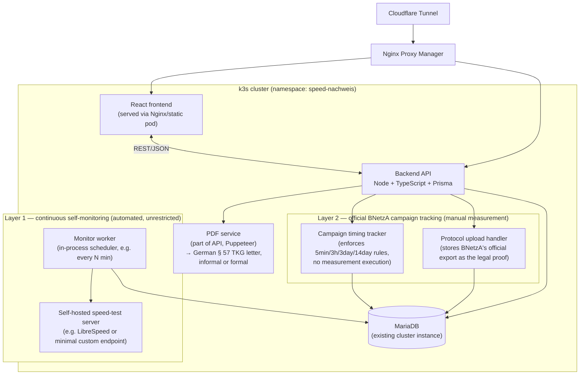

# Speed-Nachweis — Project Plan

Self-hosted tool to help prove ISP underperformance under § 57 TKG. **Two-layer design** (see §2a for why): a fully-automated Layer 1 continuously self-monitors the connection for documentation purposes, while Layer 2 tracks the official BNetzA campaign timing rules and ingests the user's own official protocol export as the actual legal proof. Generates a German-language complaint letter either way. Deploys on the k3s/ArgoCD homelab cluster. Stays fully open source.

## 1. Goal

- **Layer 1 (automated, unrestricted):** continuously run speed tests against our own self-hosted server, store every result, and surface trend stats / sustained-underperformance patterns as supporting documentation. This is explicit self-monitoring, not a claim to be the certified § 57 TKG mechanism — running it is not legally restricted.
- **Layer 2 (manual measurement, automated tracking):** track the official 30-measurement BNetzA campaign's timing state and tell the user exactly when the next measurement in BNetzA's real Desktop-App is allowed. The user runs each measurement themselves in the official app and uploads BNetzA's own protocol export once done — that upload is the actual legal proof, not anything this tool generates. `evaluateCampaign()` stays available as a live, clearly-labeled *estimate* during the campaign, based on the user's own self-reported per-measurement numbers.
- Generate a German-language complaint letter (DIN 5008 conventions, § 57 TKG citation) usable either informally (Layer 1 documentation only, to prompt the ISP to investigate) or formally (Layer 2's uploaded official protocol attached as the legal basis).
- React dashboard covering both layers: continuous monitoring/trend view, campaign timing tracker + protocol upload, and letter preview/download.
- No auto-sending to the ISP — human clicks send, always.

## 2. Legal rules to encode (recap)

**Campaign rules (fixed-line) — these govern Layer 2, and are what the tracker enforces (timing only, not the measurement itself):**
- 30 measurements total, over exactly 3 calendar days, 10/day
- ≥5 min between consecutive measurements
- ≥3 hour gap between measurement 5 and 6 each day
- Whole campaign must finish within 14 days of starting
- Wired connection only — enforced by BNetzA's Desktop-App itself via local NIC inspection, which is exactly why we can't run the official measurement for the user (see §2a)

**Underperformance — ANY one of these fails it:**
1. Max speed not hit (≥90%) on at least 2 of 3 days
2. "Normal" speed not reached in 90% of all 30 measurements
3. Min speed undercut on at least 2 of 3 days

Compared against the 3 contract values from the Vertragszusammenfassung (max / normal / min) — user enters these once at setup.

**On failure:** proportional bill reduction (Minderung) + special termination right if unresolved. Protocol should be used within 4 weeks of completion.

## 2a. Why two layers — spike findings (resolved 2026-09-04)

The original single-engine design (automate the whole 30-measurement campaign end-to-end via a headless/scripted client) does not hold up legally. Confirmed by reading BNetzA's fixed-line Handreichung and the breitbandmessung.de FAQ directly:

- § 57 Abs. 4 TKG requires the deviation be proven "durch einen von der Bundesnetzagentur bereitgestellten Überwachungsmechanismus" — the Handreichung names this mechanism explicitly as the **Desktop-App**, not merely "the same open-source protocol run anywhere."
- FAQ, verbatim: Browsermessung (browser-based test) results **cannot be used as legal proof** — only the Desktop-App's Nachweisverfahren counts.
- FAQ, verbatim: *"Automatisierte Messungen werden nicht unterstützt und bei zu vielen erkannten Messungen werden weitere Messdurchführungen für eine definierte Zeit abgewiesen."* — automated measurements are explicitly unsupported and actively detected/blocked.
- Handreichung: this is a deliberate legal-certainty design choice, not a technical gap — *"muss jede einzelne Messung manuell initiiert werden"* (each individual measurement must be manually initiated by the user).
- The wired-vs-WiFi check is performed by the installed Desktop-App itself inspecting the local NIC — not reproducible from a browser/headless context at all.

Technically, headless automation of the underlying open-source client (`ias-client-js`) does work fine (verified against real BNetzA servers via Playwright) — that was never the blocker. The blocker is that automating it, even successfully, produces something BNetzA's own rules explicitly exclude from legal recognition. Hence the split: automate what's actually unrestricted (self-monitoring against our own server), and for the part that must legally go through BNetzA's own app, automate only the *tracking* around it, not the measurement itself.

## 3. Architecture



The official BNetzA Desktop-App and breitbandmessung.de servers are **not** in this diagram — they run entirely outside our system, on the user's own machine, per §2a. Our system never talks to BNetzA's measurement infrastructure; it only tracks timing and accepts the resulting file upload.

Fits the existing pattern: GHCR image via GitHub Actions → ArgoCD app-of-apps → `apps/speed-nachweis/` in the `argocd` repo → exposed under `speedcheck.lennox-rose.com` through the existing Cloudflare Tunnel + NPM setup.

## 4. Components

### 4.1 Layer 1 — self-hosted speed-test server
- A self-hosted throughput target under our own control — e.g. an existing open-source option like LibreSpeed, or a minimal custom download/upload endpoint. Deliberately **not** BNetzA's client/protocol — this must stay clearly a self-test against our own infrastructure, not something that could be confused with or marketed as the official mechanism.
- Runs in-cluster (or anywhere reachable from the monitor worker); no relation to breitbandmessung.de at all.

### 4.2 Layer 1 — monitor worker
- Fully automated, unrestricted: no BNetzA rules apply here since it never claims to be the certified mechanism. Runs on a simple fixed interval (e.g. every N minutes, configurable), 24/7.
- Each run: one quick down/up/ping test against the Layer 1 speed-test server, result written straight to the DB.
- Also owns the trend/aggregation logic: rolling-window stats (e.g. "X% of measurements over the last N days were below contracted speed") used both for the dashboard and for flagging sustained underperformance worth documenting.

### 4.3 Layer 2 — campaign timing tracker
- Enforces the BNetzA timing rules (§2) purely as a *reminder/gate*: given the campaign's measurement history, compute whether "run the next measurement now" is currently allowed, and if not, when it will be.
- Does **not** execute any measurement itself — the user runs it in BNetzA's real Desktop-App, off-system.
- After each real-world measurement, the user logs the result (down/up/ping, which day) back into ISPwatcher so campaign progress and the live estimate can be shown. This is self-reported data entry, not something we scrape or automate.
- `evaluateCampaign()` (already implemented) runs against these self-reported measurements as a **live estimate** — UI must clearly label it as such, never as the legal determination.

### 4.4 Layer 2 — official protocol upload
- Once BNetzA's Desktop-App produces its own signed protocol export (only generated if it detects underperformance — see Handreichung), the user uploads that file to ISPwatcher.
- Stored as-is (e.g. PDF) against the campaign; this upload — not `evaluateCampaign()`'s estimate — is the actual legal proof referenced by a formal complaint letter.
- No attempt to parse/extract structured data from BNetzA's export; it's an opaque attachment plus an upload timestamp.

### 4.5 Backend API — Node + TypeScript + Prisma
Matches the existing stack. Responsibilities now span both layers:
- CRUD for contract config (max/normal/min speed, ISP name/address)
- Layer 1: expose monitoring history + trend stats
- Layer 2: campaign lifecycle (start, log a self-reported measurement, mark complete), timing-gate queries, protocol upload endpoint
- Complaint letter generation trigger, in either informal (Layer 1 only) or formal (Layer 2 + protocol) mode
- Auth: simple, single-user (it's your own tool) — API key or basic auth behind the tunnel is enough, no need for full user management

### 4.6 PDF generation — German § 57 TKG letter
- Puppeteer (HTML template → PDF), consistent with the rest of the stack.
- **Must be German-language and follow German legal-letter conventions** (DIN 5008 layout, correct § 57 TKG citation) — a rejected-on-formality complaint is a real risk, not just a translation nicety.
- Two modes, same template family:
  - **Informal**: Layer 1 trend documentation only, framed as "please investigate," with an explicit disclaimer that this is self-collected monitoring data, not the certified BNetzA mechanism.
  - **Formal**: full Minderung/Sonderkündigung demand, BNetzA's official protocol attached as the legal basis, § 57 TKG citation, computed Minderung suggestion.
- Wherever self-collected (Layer 1 or in-progress Layer 2 estimate) data is shown or referenced, a disclaimer distinguishing it from the certified official protocol is required — not optional styling.

### 4.7 Frontend — React
- Setup screen: contract speeds, ISP details.
- Layer 1 view: live trend chart, rolling-window underperformance flags, "generate informal complaint" action.
- Layer 2 view: campaign timing tracker (next allowed measurement time, X/30 progress, day X/3), a small form to log each self-reported measurement, live estimate (clearly labeled), protocol upload, "generate formal complaint" action once uploaded.
- Result view: letter preview/download, "mark as sent" tracking.
- Nothing fancy needed — Vite + React, talks to the API over REST.

## 5. Data model (sketch)

Layer 1 and Layer 2 get their own storage — they represent fundamentally different evidence tiers (unrestricted self-monitoring vs. the officially tracked campaign) and must not be conflated in the schema, even though both eventually feed a `ComplaintDraft`.

```
Contract
  id, ispName, ispAddress, maxSpeedMbit, normalSpeedMbit, minSpeedMbit, createdAt

# --- Layer 1: continuous self-monitoring (fully automated) ---

MonitoringRun
  id, contractId, timestamp, downloadMbit, uploadMbit, pingMs
  # one row per automated run against our own speed-test server.
  # Trend/rolling-window stats are computed on read from this table,
  # not persisted separately, unless a caching need shows up later.

# --- Layer 2: official BNetzA campaign tracking (manual measurement, automated tracking) ---

Campaign
  id, contractId, status (pending|running|complete|failed_insufficient_data)
  startedAt, completedAt

CampaignMeasurement
  id, campaignId, timestamp, downloadMbit, uploadMbit, pingMs, dayIndex (1-3)
  # self-reported by the user after each real Desktop-App run.
  # Feeds evaluateCampaign()'s live estimate — an estimate input,
  # never itself the legal proof.

OfficialProtocol
  id, campaignId (unique), filePath, uploadedAt
  # BNetzA's own signed export, stored opaquely. This IS the legal proof;
  # no structured data is parsed out of it.

# --- Complaint letters, either evidence tier ---

ComplaintDraft
  id, contractId, campaignId (nullable — set once upgraded to formal),
  basis (self_monitoring_only | official_protocol),
  pdfPath, generatedAt, sentAt (nullable), claimedReductionPercent (nullable)
```

## 6. Threshold evaluation (pseudocode)

### 6a. Layer 2 — `evaluateCampaign()`, live estimate only

Already implemented (`campaign.service.ts`) against `CampaignMeasurement` rows. Unchanged logic, just reframed: this is a preview for the user while the campaign is running, not the legal determination — that comes from whatever BNetzA's own uploaded protocol says.

```
function evaluate(campaign, contract):
    days = groupByDay(campaign.measurements)  # 3 groups of 10
    maxFail  = count(days where max(day.speeds) < 0.9 * contract.maxSpeedMbit) >= 2
    normFail = percentBelow(campaign.measurements, contract.normalSpeedMbit) > 10%
    minFail  = count(days where min(day.speeds) < contract.minSpeedMbit) >= 2

    if maxFail or normFail or minFail:
        return UNDERPERFORMING (ESTIMATE), reasonsFor(maxFail, normFail, minFail)
    return OK (ESTIMATE)
```

### 6b. Layer 1 — trend flagging, not the same criteria

Deliberately simpler than the § 57 TKG criteria above — this is documentation, not a legal test, so it doesn't need to mirror the 3-day/30-measurement structure.

```
function flagTrend(monitoringRuns, contract, windowDays):
    recent = monitoringRuns.filter(within windowDays)
    belowContractPct = percentBelow(recent, contract.normalSpeedMbit)

    if belowContractPct > someThreshold and recent.count >= someMinimumSampleSize:
        return SUSTAINED_UNDERPERFORMANCE_PATTERN, { belowContractPct, windowDays, sampleSize }
    return NOTHING_FLAGGED
```

## 7. Deployment plan (k3s / ArgoCD)

1. New repo `speed-nachweis` (or a monorepo with `frontend/`, `backend/`, `engine/` folders).
2. Dockerfiles for frontend (static build served by nginx) and backend; GitHub Actions builds both to `ghcr.io/lennoxrose/speed-nachweis-frontend` and `-backend` on push, same pattern as `cloudflare-ddns`.
3. New `apps/speed-nachweis/` folder in the `argocd` repo: Deployment + Service for frontend, Deployment + Service for backend (including the Layer 1 monitor worker, in-process), Deployment + Service for the Layer 1 self-hosted speed-test server, a MariaDB database + user (either provision in the existing MariaDB instance, or a dedicated PVC-backed instance if you want isolation — existing `nfs-storage` StorageClass handles the PVC either way).
4. Secrets (DB creds, any API keys) go through the existing SOPS + KSOPS pipeline — same as the `cloudflare-ddns` secret.
5. Register the app in the app-of-apps root so ArgoCD auto-syncs it, no manual `kubectl apply`.
6. Expose via NPM + the existing Cloudflare Tunnel under something like `speedcheck.lennox-rose.com`.

## 8. Suggested build order (MVP-first)

1. ~~**Spike:** get the BNetzA engine running headlessly...~~ **Done (2026-09-04).** Headless automation works fine technically, but the resulting measurement isn't legally recognized — see §2a. This is what drove the two-layer redesign; the steps below replace the old single-engine plan.
2. Data model + backend CRUD (contract, campaign) with Prisma/MariaDB — **done**, plus `evaluateCampaign()` against self-reported `CampaignMeasurement` rows (Layer 2 estimate) — **done**.
3. Layer 1: self-hosted speed-test server + monitor worker, writing `MonitoringRun` rows on a fixed interval; trend/rolling-window flagging logic.
4. Layer 2: campaign timing tracker (gate/reminder logic against the existing spacing rules) + endpoint to log a self-reported `CampaignMeasurement` + protocol upload endpoint (`OfficialProtocol`).
5. PDF generation: German § 57 TKG letter template, informal (Layer 1 only) and formal (Layer 2 + uploaded protocol) modes.
6. React frontend wired to both layers' endpoints.
7. Dockerize, GitHub Actions build, ArgoCD app (including the new speed-test server deployment), deploy behind NPM/tunnel.
8. Dogfood Layer 1 continuously on your own connection; run one real Layer 2 campaign through the actual Desktop-App and sanity-check the tracker's timing gates plus the generated letters (both modes) before trusting either for anything real.

## 9. Open risks

- ~~Legal weight of headless measurements~~ — **resolved**, see §2a. Answer was "no," which is why the design changed.
- **Layer 1's self-hosted server may not be representative** of real-world path performance the way BNetzA's distributed measurement infrastructure is — acceptable since it's explicitly documentation-only, but worth stating clearly in the UI/letter so it doesn't read as more authoritative than it is.
- **An ISP could reject even a well-formed informal complaint** since it's not backed by the certified mechanism — the letter's disclaimer needs to set that expectation honestly rather than overselling Layer 1 data.
- **Self-reported `CampaignMeasurement` entry is manual and error-prone** (typos, wrong day) — it only drives an estimate, but a wildly wrong estimate mid-campaign is worse than none; consider basic sanity-range validation on entry.
- **`OfficialProtocol` is stored opaquely, never parsed** — by design (§4.4), but means the app can't cross-check the user's estimate against the real outcome automatically; that comparison, if wanted later, would be manual.
- Layer 1's continuous testing runs 24/7 against our own server — worth keeping an eye on resource use (bandwidth, DB row growth) now that there's no natural stopping point the way a 30-measurement campaign has one.